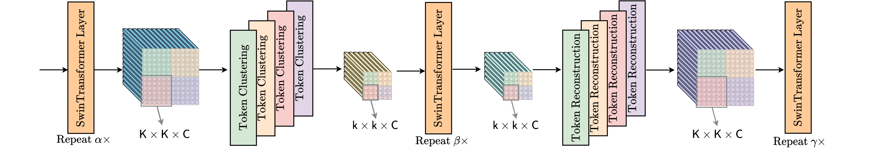

<!-- <h2 align="left">detrex</h2>
<p align="left">
    <a href="https://github.com/IDEA-Research/detrex/releases">
        
    </a>
    <a href="https://detrex.readthedocs.io/en/latest/index.html">
        
    </a>
    <a href='https://detrex.readthedocs.io/en/latest/?badge=latest'>
    
    </a>
    <a href="https://github.com/IDEA-Research/detrex/blob/main/LICENSE">
        
    </a>
    <a href="https://github.com/IDEA-Research/detrex/pulls">
        
    </a>
    <a href="https://github.com/IDEA-Research/detrex/issues">
        
    </a>
</p>

[📘Documentation](https://detrex.readthedocs.io/en/latest/index.html) |
[🛠️Installation](https://detrex.readthedocs.io/en/latest/tutorials/Installation.html) |
[👀Model Zoo](https://detrex.readthedocs.io/en/latest/tutorials/Model_Zoo.html) |
[🚀Awesome DETR](https://github.com/IDEA-Research/awesome-detection-transformer) |
[🆕News](#whats-new) |
[🤔Reporting Issues](https://github.com/IDEA-Research/detrex/issues/new/choose) -->

# Expediting Large-Scale Vision Transformer for Dense Prediction without Fine-tuning


## Introduction

This is the official implementation of the paper "[Expediting Large-Scale Vision Transformer for Dense Prediction without Fine-tuning](https://arxiv.org/abs/2210.01035)" on [DINO](https://arxiv.org/abs/2104.14294) and [MaskDINO](https://arxiv.org/abs/2206.02777). You can try our method on other frameworks.




## Results 

Here we implement our method on Swin backbone. Thus we report the GFLOPs and FPS of backbone. 

### Object Dectection

| Method           | Backbone | $\alpha$ | h $\times$ w   | GFLOPs | FPS   | mAP  |
| ---------------- | -------- | -------- | -------------- | ------ | ----- | ----- |
| DINO        | Swin-L | -        | 12 $\times$ 12 | 937 | 4.42  |  58.5 |
| DINO + Ours | Swin-L | 16       |  9 $\times$ 9  | 838 | 4.90  |  58.0 |
| DINO + Ours | Swin-L | 14       |  8 $\times$ 8  | 768 | 5.32  |  57.7 |
| DINO + Ours | Swin-L | 10       |  8 $\times$ 8  | 683 | 5.82  |  57.0 |

### Instance Segmentation

| Method           | Backbone | $\alpha$ | h $\times$ w   | GFLOPs | FPS   | Mask AP  |
| ---------------- | -------- | -------- | -------------- | ------ | ----- | ----- |
| MaskDINO        | Swin-L | -        | 12 $\times$ 12 | 937 | 4.42  |  52.3 |
| MaskDINO + Ours | Swin-L | 16       |  9 $\times$ 9  | 838 | 4.90  |  52.1 |
| MaskDINO + Ours | Swin-L | 10       |  9 $\times$ 9  | 737 | 5.32  |  51.6 |
| MaskDINO + Ours | Swin-L | 8        |  8 $\times$ 8  | 640 | 5.82  |  50.9 |

### Panoptic Segmentation

| Method           | Backbone | $\alpha$ | h $\times$ w   | GFLOPs | FPS   | PQ  |
| ---------------- | -------- | -------- | -------------- | ------ | ----- | ----- |
| MaskDINO        | Swin-L | -        | 12 $\times$ 12 | 937 | 4.42  |  58.3 |
| MaskDINO + Ours | Swin-L | 16       |  9 $\times$ 9  | 838 | 4.75  |  58.1 |
| MaskDINO + Ours | Swin-L | 12       |  9 $\times$ 9  | 771 | 5.20  |  57.9 |
| MaskDINO + Ours | Swin-L | 10       |  8 $\times$ 8  | 683 | 5.80  |  57.4 |

## Installation

Please refer to [Installation Instructions](https://detrex.readthedocs.io/en/latest/tutorials/Installation.html) for the details of installation. Note that you need to install this repo instead of original detrex.

## Getting Started

If you want to evaluate DINO with our method, you need to download the specified checkpoint released in [DINO](projects/dino/), and consider running following command:

```bash
python tools/train_net.py --config-file projects/dino/configs/dino_hourglass_swin_large_384_5scale_36ep.py --num-gpus 4 --eval-only train.init_checkpoint=/path/to/checkpoint
```

If you want to evaluate MaskDINO with our method, you need to download the specified checkpoint released in [MaskDINO](projects/maskdino/), and consider running following command:

```bash
python tools/train_net.py --config-file projects/maskdino/configs/maskdino_hourglass_swin_large_384_coco_instance_seg_50ep.py --num-gpus 4 --eval-only train.init_checkpoint=/path/to/checkpoint
```

```bash
python tools/train_net.py --config-file projects/maskdino/configs/maskdino_hourglass_swin_large_384_coco_panoptic_seg_50ep.py --num-gpus 4 --eval-only train.init_checkpoint=/path/to/checkpoint
```

## License

This project is released under the [Apache 2.0 license](LICENSE).


## Acknowledgement
The repo is built based on [detrex](https://github.com/IDEA-Research/detrex) v0.2.0.


## Citation
If you find this project useful in your research, please consider cite:

```BibTex
@article{yuan2023expediting,
	author    = {Yuan, Yuhui and Liang, Weicong and Ding, Henghui and Liang, Zhanhao, and Zhang, Chao and Hu, Han},
	title     = {Expediting large-scale vision transformer for dense prediction without fine-tuning},
	journal   = {TPAMI},
	year      = {2023},
}

@article{liang2022expediting,
  title={Expediting large-scale vision transformer for dense prediction without fine-tuning},
  author={Liang, Weicong and Yuan, Yuhui and Ding, Henghui and Luo, Xiao and Lin, Weihong and Jia, Ding and Zhang, Zheng and Zhang, Chao and Hu, Han},
  journal={Advances in Neural Information Processing Systems},
  volume={35},
  pages={35462--35477},
  year={2022}
}
```

```BibTex
@misc{zhang2022dino,
      title={DINO: DETR with Improved DeNoising Anchor Boxes for End-to-End Object Detection}, 
      author={Hao Zhang and Feng Li and Shilong Liu and Lei Zhang and Hang Su and Jun Zhu and Lionel M. Ni and Heung-Yeung Shum},
      year={2022},
      eprint={2203.03605},
      archivePrefix={arXiv},
      primaryClass={cs.CV}
}
```

```BibTex
@misc{li2022mask,
      title={Mask DINO: Towards A Unified Transformer-based Framework for Object Detection and Segmentation}, 
      author={Feng Li and Hao Zhang and Huaizhe xu and Shilong Liu and Lei Zhang and Lionel M. Ni and Heung-Yeung Shum},
      year={2022},
      eprint={2206.02777},
      archivePrefix={arXiv},
      primaryClass={cs.CV}
}
```


